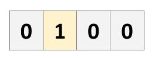

# gym_game

This repository contains a simple game, wrapped to match the [OpenAI Gym](https://gym.openai.com/) API.

## The Game:
The player must fill all vacant cells of the board. He must avoid trying to fill a non-vacant cell. 
An empty cell is represented by "0" and a filled cell by "1". In the example below, only the second 
cell is filled, and so the agent must select any of the other cells:



## Quick Start:
```
from gym_game import Game
env = Game()
env.reset()
```
`env` now functions similar to any basic `gym` environment.

## Installation:
```
git clone https://github.com/shakedzy/gym_game.git
pip install ./gym_game
```
**Dependencies:** `numpy`